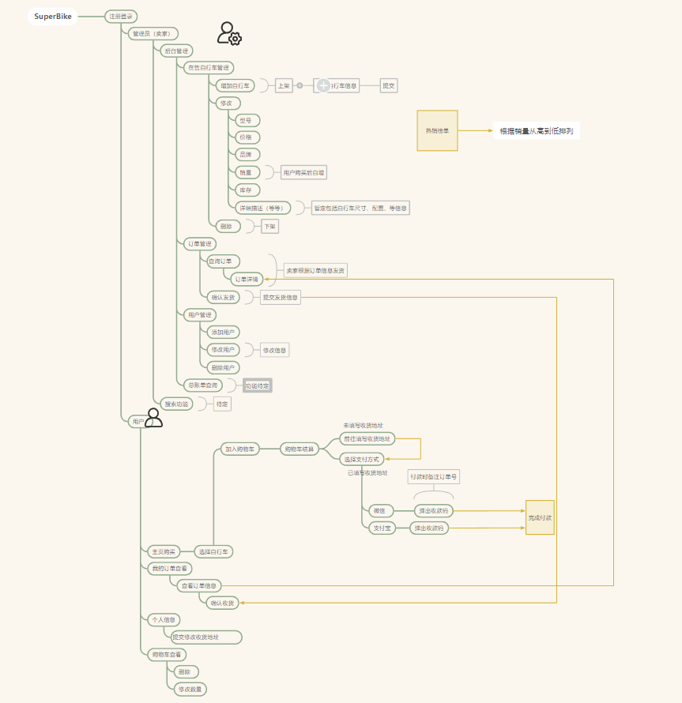

## SuperBike自行车网上销售系统（软件工程课程项目）
### 项目简介
本项目是一个基于Java的Web应用程序，是一个自行车销售系统。该系统允许用户浏览和购买自行车，管理员可以添加、删除和更新自行车信息。本项目是软件工程课程的一个项目，用于学习软件工程的相关知识，提升实践开发能力。由三人小组合作开发实施。
### 项目目标
- 了解软件工程的基本概念和方法
- 掌握软件工程的基本流程和方法
- 掌握软件工程的基本工具和技术
- 掌握软件工程的基本原则和规范
- 提升团队协作和沟通能力
- 提升实践开发能力
- 提升项目管理能力

### 项目功能
- 用户注册、登录、注销
- 用户浏览自行车信息
- 用户购买自行车
- 管理员添加、删除、更新自行车信息
- 管理员查看用户信息
- 管理员查看订单信息
- 管理员查看自行车信息


### 项目技术
- Java  1.8
- Servlet
- JSP
- JDBC
- MySQL 8
- Tomcat
- HTML、CSS、JavaScript
- Git
- IntelliJ IDEA 2024.1
- Navicat 16

### 项目流程
- 需求分析
- 概要设计
- 编码
- 测试
- 部署
- 维护

### 项目时间
2024年3月-2024年7月
### 项目文档
- 项目计划
- 项目需求规格说明
- 项目概要设计
- 项目详细设计
- 项目测试计划
- 项目用户手册
- 项目管理手册
### 项目概要构思
- 

### 数据库设计
```建模
   
```

### 项目进度
- 需求分析：已完成
- 概要设计：已完成
- 编码：进行中
- 测试：未开始
- 部署：未开始
- 维护：未开始

